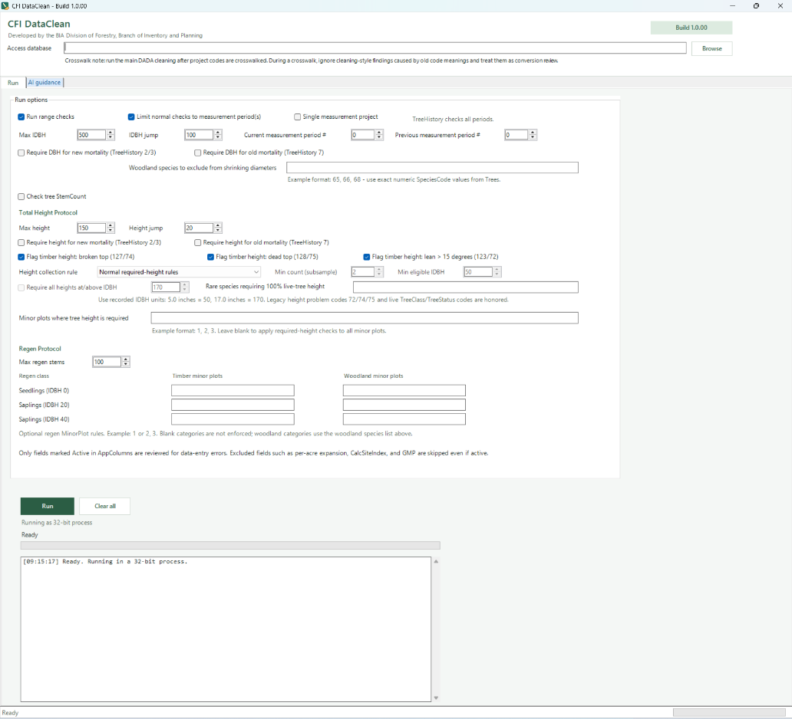
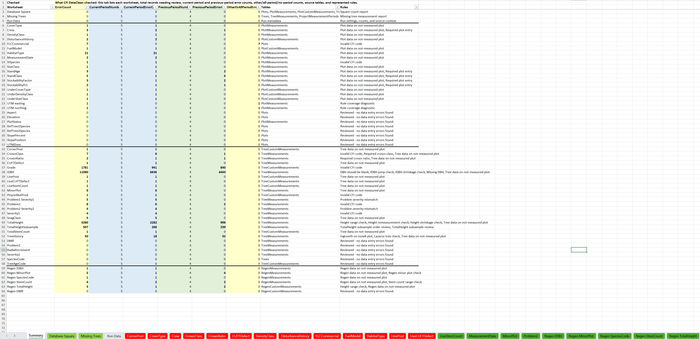

# CFI DataClean

**Repeatable quality control for CFI forest inventory data stored in Microsoft Access.**

**Current build:** `1.0.00`  
**Developer:** Christopher LaCroix, USDI BIA Division of Forestry, Branch of Forest Inventory and Planning

## What it is

CFI DataClean is a Windows desktop application that reviews CFI-style `.mdb` and `.accdb` databases for likely data-entry errors, missing records, invalid codes, and inconsistencies across measurement periods. It turns the findings into a structured Excel workbook that is easier to filter, verify, and hand off for correction.

> **Non-destructive by design:** a Run checks a temporary copy of the selected database. CFI DataClean does not edit or delete records in the source database.

## Why it exists

CFI project data is distributed across related plot, tree, regeneration, and custom-measurement tables. Reviewing those relationships manually can be slow, inconsistent, and difficult to repeat across projects.

CFI DataClean converts common quality-control rules into a repeatable workflow. It identifies records that need attention and supplies the context needed to investigate them, including remarks, measurement-period history, record identifiers, and verification SQL when available. The reviewer still confirms each correction against field records, project guidance, and the source database.

## Key features

- Reviews plot, tree, regeneration, and custom-measurement data in one run.
- Detects missing measurements, duplicate keys, invalid codes, incomplete required fields, range problems, and table-count mismatches.
- Compares measurement periods for IDBH and height changes, shrinkage, TreeHistory transitions, ingrowth, and related consistency issues.
- Uses `AppColumns` and `AppColumnCodes` metadata to respect active fields and project code lists.
- Supports configurable period scope, thresholds, total-height protocols, woodland exclusions, and regeneration minor-plot rules.
- Exports an `.xlsx` workbook with a Summary, project-wide checks, field-specific tabs, period context, remarks, and verification SQL.
- Writes a matching text run log with progress, timing, and troubleshooting details.
- Provides optional project-manual and Azure AI guidance without making AI a requirement for the core cleaning workflow.

## Screenshots

### Configure a cleaning review

### Review the exported findings

## Installation

### Requirements

- Windows
- Microsoft Access or the Microsoft Access Database Engine installed in 32-bit form
- The 32-bit ACE provider for `.accdb` files; older `.mdb` files may also use the 32-bit Jet provider

### Run the application

1. Download the release ZIP and choose **Extract All**. Do not run the application from inside the compressed-folder preview.
2. Keep `CFI DataClean.cmd` beside the `_CFIDataClean_AppFiles` folder.
3. Double-click `CFI DataClean.cmd`.
4. Select a CFI Access database when the application opens.

Startup troubleshooting and managed-deployment guidance are covered in the [User Guide](CFIDataClean-How-To-Guide.html).

## Example workflow

1. Complete any required project-code crosswalk. For legacy projects, the post-crosswalk run should be the primary cleaning review.
2. Select the Access database. CFI DataClean detects available measurement periods and fills the current and previous period settings when possible.
3. Review the run options, including thresholds, period scope, height protocol, woodland species, and regeneration rules. Project-manual and AI guidance are optional.
4. Click **Run**. The application checks a temporary database copy and creates an Excel workbook plus a text run log.
5. Begin with the workbook Summary and red tabs. Review the supporting context and run the supplied verification SQL in Access when useful.
6. Update the source database only after the field record or project guidance confirms the correction.

## Technologies used

- Windows PowerShell and .NET Windows Forms
- `System.Data.OleDb` with 32-bit Microsoft ACE/Jet providers
- Native Open XML generation for `.xlsx` reports
- PowerShell runspaces for responsive background processing and cancellation
- Optional Azure AI Foundry integration through REST APIs

## Documentation

The complete operating instructions, run-option definitions, cleaning-rule explanations, AI setup, workbook guidance, and troubleshooting steps are maintained in the [CFI DataClean User Guide](CFIDataClean-How-To-Guide.html).

Additional references:

- [Security and data-flow notes](_CFIDataClean_AppFiles/SECURITY.md)
- [TreeClass, TreeStatus, and TreeHistory crosswalk](_CFIDataClean_AppFiles/References/TreeClass_Status_History_Crosswalk.xlsx)

## Acknowledgements

Selected reference checks were adapted from `CFI DB Cleaning 2.5.2026c.Rmd`, a CFI data-cleaning R script developed by Jesse Wooten. CFI DataClean implements those checks directly and does not require R to run.
